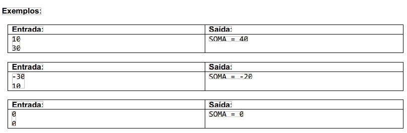
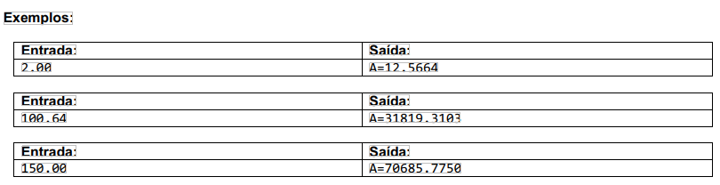
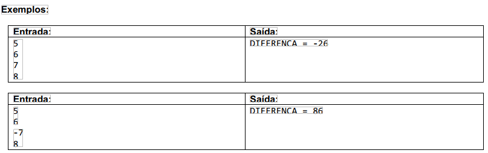
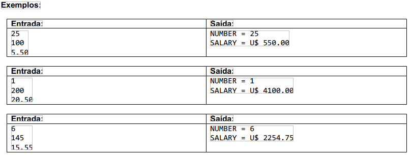
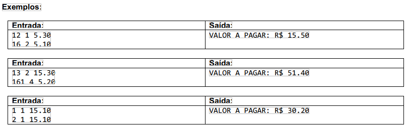
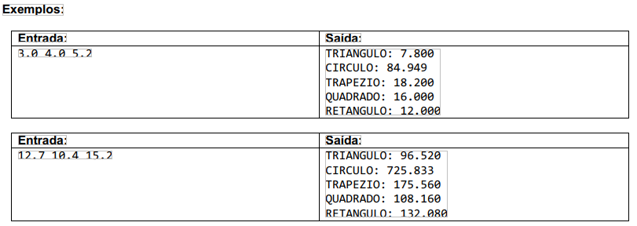

    
    <h1>:rocket: Exercícios C# Sobre estrutura sequencial</h1>

&nbsp;

- 01 - [Faça um programa para lerdois valores inteiros, e depois mostrar na tela a soma desses números com uma mensagem explicativa, conforme exemplos.]('./01_Exercicio/Program.cs')

&nbsp;

- 02 - [Faça um programa para lero valor do raio de um círculo, e depois mostrar o valor da área deste círculocom quatro casas decimaisconforme exemplos.]('./02_Exercicio/02_Exercicio/Program.cs')
    
    Fórmula da área:area = π . raio2

    Considere o valor deπ = 3.14159

    
    

&nbsp;

- 03 - [Fazer um programa para lerquatro valores inteiros A, B, C e D. A seguir, calcule e mostre a diferença do produto de A e B pelo produto de C e D segundo a fórmula: DIFERENCA = (A * B-C * D).]('./03_Exercicio/03_Exercicio/Program.cs')

    
    

&nbsp;

- 04 - [Fazer um programa que leia o número de um funcionário, seu número de horas trabalhadas, o valor que recebe por hora e calcula o salário desse funcionário. A seguir, mostre o número e o salário do funcionário, com duas casas decimais.]('./04_Exercicio/04_Exercicio/Program.cs')

    
    

&nbsp;

- 05 - [Fazer um programa paraler o código de uma peça 1, o número de peças 1, o valor unitário de cada peça 1, o código de uma peça 2, o número de peças 2 e o valor unitário de cada peça 2.Calcule e mostre o valor a ser pago.]('./05_Exercicio/05_Exercicio/Program.cs')

    
    

&nbsp;

- 06 - [Fazerum programa que leia três valores com ponto flutuante de dupla precisão: A, B e C. Em seguida, calcule e mostre:]('./06_Exercicio/06_Exercicio/Program.cs')

    - a) a área do triângulo retângulo que tem A por base e C por altura.
  - b) a área do círculo de raio C. (pi = 3.14159)
  - c) a área do trapézio que tem A e B por bases e C por altura.
  - d) a área do quadrado que tem lado B.
  - e) a área do retângulo que tem lados A e B.

