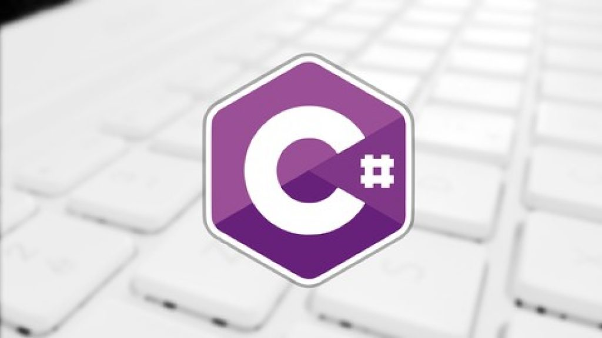

    
   
<h1 >C# COMPLETO Programação Orientada a Objetos + Projetos
</h1>
 <h3>Repositório para armazenamento dos exercícios do curso <a href="https://www.udemy.com/course/programacao-orientada-a-objetos-csharp"> C# COMPLETO Programação Orientada a Objetos + Projetos </a>
</h3>

  

  

  

  

## :sparkles: Ementa do cusro ##

:heavy_check_mark: Introdução a C# e .NET;\
:heavy_check_mark: Lógica de programação com C#;\
:heavy_check_mark: Classes, atributos, métodos, membros estáticos;\
:heavy_check_mark: Construtores, this, sobrecarga, encapsulamento;\
:heavy_check_mark: Comportamento de memória, arrays, listas;\
:heavy_check_mark: Enumerações e composição;\
:heavy_check_mark: Herança e polimorfismo;\
:heavy_check_mark: Tratamento de exceções;\
:heavy_check_mark: Trabalhando com arquivos;\
:heavy_check_mark: Interfaces;\
:heavy_check_mark: Generics, Set, Dictionary;\
:heavy_check_mark: Expressões lambda, delegates, LINQ;

## :rocket: Projetos ##

- [Projeto: Sistema de jogo de xadrez]('/')
- [Projeto: Sistema Web com ASP .NET Core MVC e Entity Framework]('/')

